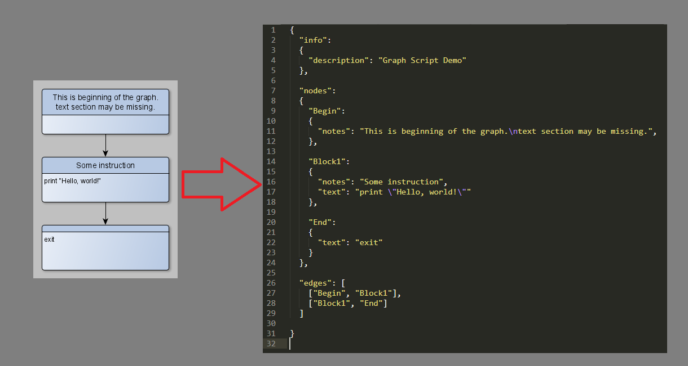

# Gript

Oriented graph scripting engine.

The idea is as follows:
- There is a description of the oriented graph in Json (custom JGraph format)
- Graph nodes contain specific instructions for execution
- The graph is traversed by a virtual machine. Based on instructions from nodes, it performs certain actions in the context on which it is executed
- Instructions are implementation-specific (whatever the developer wants, will add)
- It is possible to import/export to yEd GraphML format

Идея следующая:
- Имеется описание ориентированного графа на Json (собственный формат JGraph)
- Узлы графа содержат определенные инструкции для исполнения
- Обход графа производит виртуальная машина. На основе инструкций из узлов она выполняет определенные действия в контексте на котором исполняется
- Инструкции определяются реализацией (что разработчик захочет, то и добавит)
- Есть возможность импорта/экспорта в формат GraphML yEd

